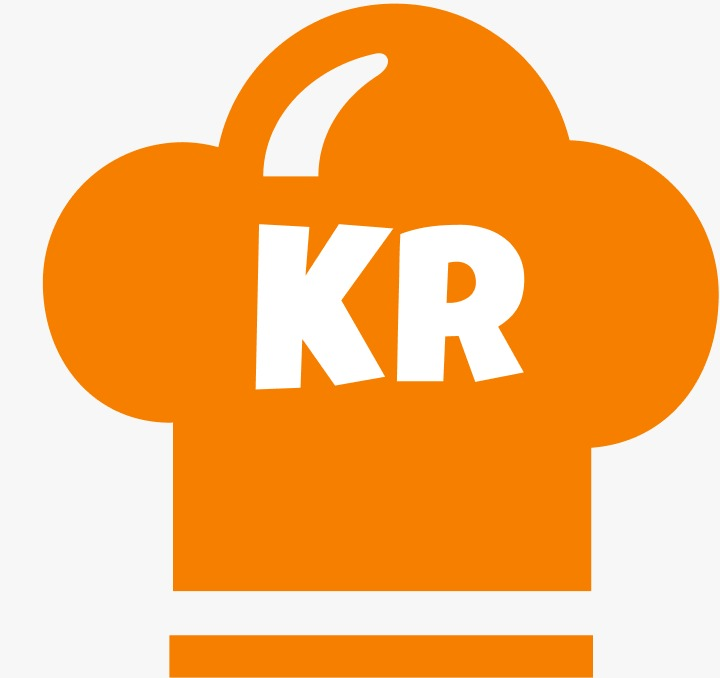
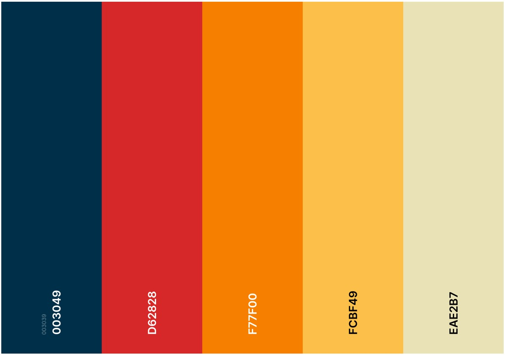
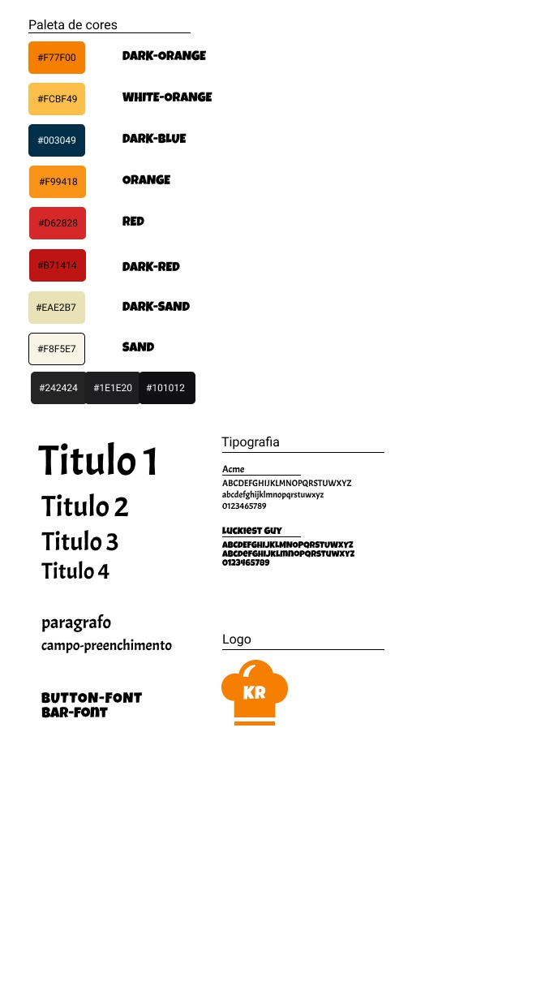

# Style Guide

## Histórico de Versão

| Data       | Versão | Descrição                           | Autor(es)     |
| ---------- | ------ | ----------------------------------- | ------------- |
| 26/09/2021 | 1.0    | Abertura do Documento               | Davi Matheus  |
| 27/09/2021 | 1.1    | Criação da Paleta de Cores e Fontes | Élias Yousef  |
| 30/09/2021 | 2.0    | Criação da Logo                     | Natanel Filho |

## 1. Introdução

 &emsp;&emsp; Este documento trata acerca do guia de estilo e manual de identidade visual do projeto Kitchen Road.

## 2. Logo

## 3. Detalhamento e Justificativas

### 3.1 Nome da Aplicação

 &emsp;&emsp; Para o nome da aplicação foi traduzido a palavra "cozinha" para o inglês "kitchen" e escolhido a  palavra "road" que traduzindo para o português "estrada",juntamos essas duas palavras porque possui uma ideia de uma "Jornada na conzinha" ou um caminho para se tornar um bom chef.

### 3.2 Fontes

 &emsp;&emsp; As fontes utilizadas na aplicação são: 

- **Luckiest Guy:** para títulos.
- **Acme:**  para corpo do texto.

Para o html reconhecer a fonte, coloca-se no <head> da seguinte forma:

    <link href="https://fonts.googleapis.com/css?family=LuckiestGuy|Acme&display=swap" rel="stylesheet">

Para o css:

    $font-family: "Acme";
    $font-family: "Luckiest Guy";

### 3.3 Paleta de Cores

# 5. Componentes

